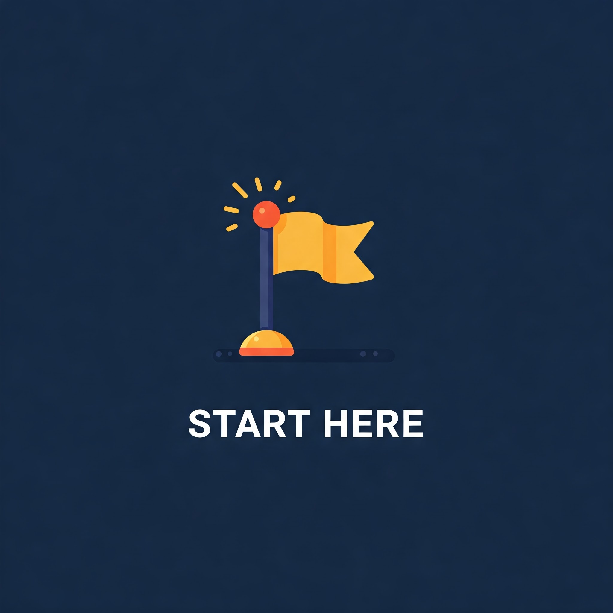

# Avengercon IX Workshop   Python Data Pipelines and Parsers

Repo Status  

<!---
Update the CI status to your repo's project name!
https://docs.github.com/en/actions/monitoring-and-troubleshooting-workflows/adding-a-workflow-status-badge
https://docs.gitlab.com/ee/user/project/badges.html#view-the-url-of-pipeline-badges
-->
<!---
Helpful sites for repo badges
https://shields.io/
https://simpleicons.org
https://github.com/NWylynko/react-simple-badges/blob/main/badges.md
-->

Tooling  

**Workshop Date**: 26 February 2025

The [Avenercon IX conference](https://avengercon.com/) homepage has details about the event where this workshop was held.

---
This is a hands-on Python programming workshop. At least one year of recent Python
experience, some experience with Docker, and a computer you administer is strongly
recommended.

Python's great power is rapid and comprehensible data analysis feeding tools like business intelligence (BI) dashboards
and artificial intelligence (AI) models that help organizations make data-driven decisions. This workshop will prepare 
you to transition from initial (and likely haphazard) data analysis into understandable, scalable, and automated best 
practices for getting data into a place and format that provides value. Pydantic, Celery, and Dask will be covered with 
data input and output to a local MinIO S3 bucket.