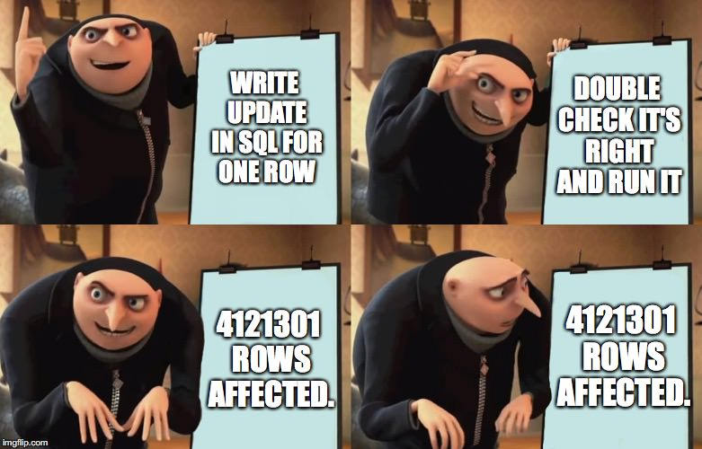

## SQL is King. Long live SQL

### Object Relational Mapper (ORM)
ORMs, like [Python's SQLAlchemy](https://docs.sqlalchemy.org/en/20/orm/), abstract SQL-based
operations into object oriented programming (OOP) APIs. This achieves a couple of things

1. Devs can now interact with SQL-based data stores without needing to know SQL (mostly)
2. SQL makes it ==**VERY**== easy to do dumb stuff. ORMs minimize this risk
3. Database migration tools like [Alembic](https://alembic.sqlalchemy.org/en/latest/) are
able to intelligently infer the difference between a current database configuration, the
new configuration you've described in the ORM, and automatically generate a nearly perfect
_migration_ script to "upgrade" the database.
    - Each _migration_ can then be versioned just like software. If something goes wrong,
    an organization can quickly and safely "downgrade" to a previous version with a single
   command.

### Data Build Tool (DBT)
[DBT](https://www.getdbt.com/) is far and away becoming a key pillar of modern data
engineering. Combine the abstraction of ORMs with the automation provided by Celery, Dask,
etc. for SQL-compliant data stores and that's generally where DBT fits in.

It's important to note that DBT by itself is popular but it's really the extensive ecosystem
being built on top of or integrating with DBT that is powerful. This is somewhat similar
to how Python doesn't necessarily have anything to do with AI... but the ecosystem of
tools enabling AI has been built with Python.