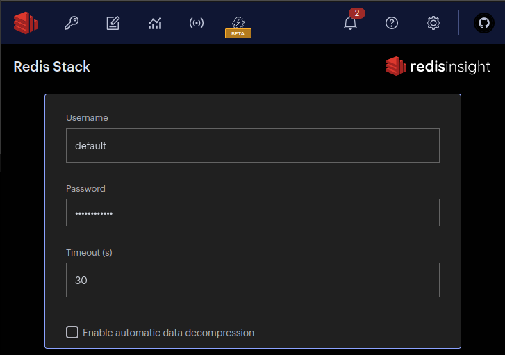
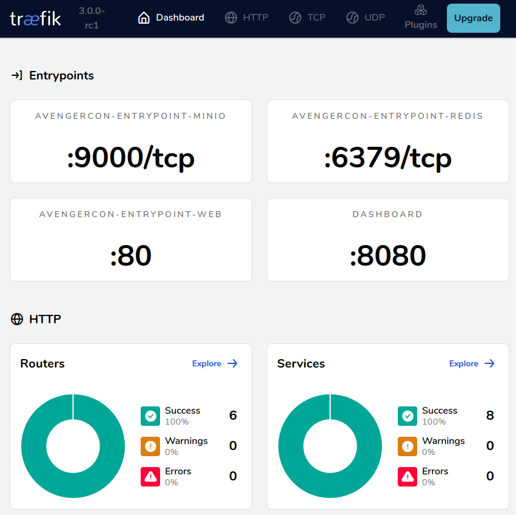

This is the beginning of our journey. Our goal is simple but not always easy: can we
get our developer environment setup?

[](https://xkcd.com/1987/)

## **Get Ready**: System-level installation


!!! tip "Dev Environment Options"
    === "Local Python, Docker Services"
        This is the recommended way to participate in the workshop. It ensures you have gone through each step to prepare
        your local dev environment to rapidly work with different python versions (via `pyenv`) and build, test, and
        publish python wheels using `poetry`.


    === "Docker Only"
        For those who don't want to make any adjustments to their local dev environment beyond running Docker containers,
        a Kasm Workspace with Ubuntu 22.04 Jammy Jellyfish and Python 3.13 is provided.

        For those on a Unix operating system:
            ```bash
            chmod +x ./run_dev_desktop.sh
            ./run_dev_desktop.sh <flag>
            ```

        For those on a Windows operating system with [Windows Subsystem for Linux (WSL) enabled](https://learn.microsoft.com/en-us/windows/wsl/install):
            ```bash
            bash run_dev_desktop.sh <flag>
            ```

        For those on an x86/AMD64 architecture CPU (Intel, AMD, etc.), running `run_dev_desktop.sh` with the `-d` flag will
        pull the AMD64 image from GitHub. For those on an ARM architecture CPU (Mac M1, etc.), use the `-m` flag to pull
        an ARM compiled workspace from Docker Hub. If neither options work, use the `-l` flag to locally build the image.
        Please note that locally building the image may take several minutes to download and build.

        The Kasm Workspace is accessible at [https://localhost:6901/](https://localhost:6901/)

        **username**: kasm_user </br>
        **password**: avengercon-2025

        

        :material-alert-circle-check:{ .green } After successfully loging in for the first time, stop the deployment with
        `ctrl+c` or `control-c` in the terminal used to run the script. Then uncomment the following lines in the appropriate 
        `docker-compose-dev-container.<architecture>.yaml` file to get a live sync of the workshop files inside the
        Kasm Workspace Ubuntu desktop. If you're using a visual IDE like VSCode or PyCharm, select the commented lines
        and press `ctrl + /` or `⌘ + /` to quickly uncomment.

        ``` py linenums="1" hl_lines="18-21" title="docker-compose-dev-container.ARCHITECTURE.yaml"
        services:
          kasm:
            container_name: kasm-ubuntu-desktop
            image: brentstone/kasm-ubuntu-desktop:0.2025.1-arm
            ports:
              - target: 6901
                published: 6901
                mode: host
            networks:
              - avengercon-dev-desktop
            volumes:
              - type: volume
                source: kasm-ubuntu-volume
                target: /home/kasm-user
                read_only: false
              # Uncomment after initial build/run of the container to enable real-time synchronization between localhost and
              # in container workshop files
        #      - type: bind
        #        source: ./
        #        target: /home/kasm-user/Desktop/avengercon_2025/
        #        read_only: false
            environment:
              # username is kasm_user
              VNC_PW: avengercon-2025
        ```

        With the updated docker-compose file, re-run `run_dev_desktop.sh` as before (don't forget any flags) and log
        back into the Kasm Workspace. You should now see an `avengercon_2025` folder in the Ubuntu desktop.

        :material-flag-checkered: **Last Steps!**
        
        1. In Kasm Workspace, open a terminal and run the `kasm-ubuntu-python-final-setup.sh` script.
        2. Verify `python --version` and `poetry --version` works in VSCode terminal
        3. Add the Python VSCode extension

You'll need the following software installed to begin:

1. [Docker](https://docs.docker.com/engine/install/)
2. [Python 3.13](https://www.python.org/downloads/)
3. [Git](https://git-scm.com/downloads)

!!! note "Optional software"
    === "Python interpreter manager"
        To keep Python from messing up your OS configs, It is recommended to install &
        manage Python interpreters using a manager like
        [pyenv](https://github.com/pyenv/pyenv?tab=readme-ov-file#installation) or
        [hatch](https://hatch.pypa.io/latest/). This will allow you to add/remove specific
        and multiple Python environments on your system. Testing your code against multiple
        versions of Python is a necessity for professional projects!
    === "Poetry"
        [Poetry](https://python-poetry.org/docs/#installation) is an alternative to `pip`.
        Those who prefer `pip` or other Python environment tools are welcome to use the
        `requirements-dev.txt` file in the **requirements** directory of this repo.
        <br/>**Why Poetry?**<br/>
        While hatch and other tools are promising, as of this workshop Poetry remains one
        of the best developer experiences (DX) for setup of python virtual environments and
        [modern pyproject.toml based Python packages](https://packaging.python.org/en/latest/specifications/pyproject-toml/#pyproject-toml-spec).
    === "Git GUI Client"
        [Git GUI Clients](https://git-scm.com/downloads/guis) simply save time. While it
        may feel nice to flex that you have every possible permutation of Git commands
        memorized, 2-second point-and-click to stage dozens of files and side-by-side
        highlighted diffs are the way to go.

## **Get Set**: Prepare your virtual environment

### Install the `avengercon` package and dependencies

1. Establish a virtual environment with `poetry env activate` or [use pip](https://packaging.python.org/en/latest/guides/installing-using-pip-and-virtual-environments/#create-and-use-virtual-environments)
    - Look for an additional command Poetry recommends you run. It'll like start with `source ...`
2. Install `avengercon` & dependencies with `poetry install` or [use pip](https://packaging.python.org/en/latest/guides/installing-using-pip-and-virtual-environments/#using-a-requirements-file)
3. Confirm that the local `avengercon` package is available in your virtual environment

```bash
(avengercon-py3.13) $ python -m avengercon
Hello, Workshop!
```

### Configure your IDE to use the virtual environment
[VSCode](https://code.visualstudio.com/docs/python/environments),
[PyCharm](https://www.jetbrains.com/help/pycharm/creating-virtual-environment.html), and
most other popular Integrated Development Environment (IDEs) support intellisense and
other productivity boosters when properly configured to use the project's virtual
environment.

!!! tip "Configure IDE to use the Poetry virtual environment"

    === ":material-microsoft-visual-studio-code: VSCode"
        1. Open the VSCode Command Pallet with `cmd + shift + p` or `command + shift + p`
        2. `Python: Select Interpreter`
        3. Select the Python interpreter located in `./.venv/...`

    === ":simple-pycharm: PyCharm"
        1. PyCharm main menu > `Settings`
        2. `Project: avengercon_2025` > `Python Interpreter`
        3. `Add Local Interpreter` > `Select Existing`
        4. **Type** `Poetry` > `Poetry env to use` > select the Python interpreter located in the `./.venv/bin` folder

### Generate your `.env` file
Using a terminal from the top level `avengercon_2025` directory, run the
`initialize_env.sh` script to dynamically generate configuration metadata in a `.env`
file.

=== "Windows"
    ``` cmd
    bash scripts\initialize_env.sh
    ```

=== "Unix (Mac/Linux)"
    ``` bash
    chmox +x scripts/initialize_env.sh
    ./scripts/initialize_env.sh
    ```

You should now see a `.env`, `.localhost.env`, and `.personal.env` files in your `avengercon_2025` directory that looks
something like this:
``` toml title=".env"
# Used by run_*.sh scripts & avengercon module to dynamically configure localhost
# development and testing environment variable coordination.
# Valid log level values: 'critical', 'error', 'warning', 'info', 'debug'
LOG_LEVEL=info
# Traefik settings and labels
HTTP_PORT=57073
DOMAIN=localhost
...
```

## 🚀 **Launch!**
Using a terminal from the top level `avengercon_2025` directory, launch the `docker
compose` deployment using the `run_dev.sh` script.

=== "Windows"
    ``` cmd
    bash run_dev.sh
    ```

=== "Unix (Mac/Linux)"
    ``` bash
    chmox +x run_dev.sh
    run_dev.sh
    ```

!!! warning "Keep your containers deployed"
    Don't close the terminal running your deployment! We'll be using the logs that
    appear to help monitor the state of our workshop's services and code.

!!! note "Port conflicts"
    If you're already running a Traefik reverse proxy or services that use the ports
    listed in the `.env`, you will need to adjust the ports being used for this workshop.

If everything is going well, you should not see any "ERR" or "ERROR" in the logs that
appear in your terminal.
``` terminal title="Happy Logs"
...
avengercon-minio   | Documentation: https://min.io/docs/minio/linux/index.html
avengercon-minio   | Warning: The standard parity is set to 0. This can lead to data loss.
avengercon-proxy   | 2024-02-15T16:35:39Z INF Traefik version 3.0.0-rc1 built on 2024-02-13T13:41:20Z version=3.0.0-rc1
avengercon-proxy   | 2024-02-15T16:35:39Z INF
avengercon-proxy   | Stats collection is disabled.
avengercon-proxy   | Help us improve Traefik by turning this feature on :)
avengercon-proxy   | More details on: https://doc.traefik.io/traefik/contributing/data-collection/
avengercon-proxy   |
avengercon-proxy   | 2024-02-15T16:35:39Z INF Starting provider aggregator aggregator.ProviderAggregator
avengercon-proxy   | 2024-02-15T16:35:39Z INF Starting provider *docker.Provider
avengercon-proxy   | 2024-02-15T16:35:39Z INF Starting provider *traefik.Provider
avengercon-proxy   | 2024-02-15T16:35:39Z INF Starting provider *acme.ChallengeTLSALPN
avengercon-minio   |
avengercon-minio   |  You are running an older version of MinIO released 1 day before the latest release
avengercon-minio   |  Update: Run `mc admin update ALIAS`
avengercon-minio   |
avengercon-minio   |
avengercon-whoami  | 2024/02/15 16:38:02 172.27.0.3:45642 - - [15/Feb/2024:16:38:02 +0000] "GET / HTTP/1.1" - -
...
```

### Verify you can access your deployed services
Ensure you can open a web browser to the following local services. For each button,
**you probably want to right-click and open in new tab**.

If anything fails to open, double-check the port in the opened link matches the port
specified by `HTTP_PORT` in your `.env` configuration. (default is `57073`; l33t speak
approximation for "Stone")

=== "Whoami"
    [Whoami :octicons-home-24:](http://whoami.localhost:57073/){ .md-button .md-button--primary}

    ``` txt title="whoami.localhost"
    Name: avengercon_whoami
    Hostname: b967780eb9c6
    IP: 127.0.0.1
    IP: ###.###.###.###
    RemoteAddr: ###.###.###.###:42012
    GET / HTTP/1.1
    Host: whoami.localhost:57073
    User-Agent: Mozilla/5.0 (X11; Linux x86_64) AppleWebKit/537.36 (KHTML, like Gecko) Chrome/121.0.0.0 Safari/537.36
    Accept: text/html,application/xhtml+xml,application/xml;q=0.9,image/avif,image/webp,image/apng,*/*;q=0.8,application/signed-exchange;v=b3;q=0.7
    Accept-Encoding: gzip, deflate, br
    ...
    ```

=== "Redis"
    [Redis :simple-redis:](http://cache.localhost:57073/){ .md-button .md-button--primary}

    The login is `default` and the password is in your `.env` as the `REDIS_PASSWORD`
    value

    

=== "MinIO"
    [MinIO :simple-minio:](http://bucket.localhost:57073/){ .md-button .md-button--primary}

    The login and password is in your `.env` as the `MINIO_ROOT_USER`
    and `MINIO_ROOT_PASSWORD` values

    

=== "Traefik"
    [Traefik :simple-traefikproxy:](http://proxy.localhost:57073/dashboard/#/){ .md-button .md-button--primary}

    