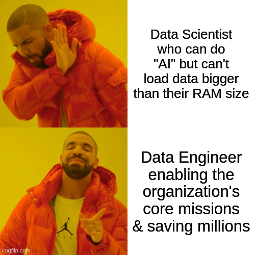
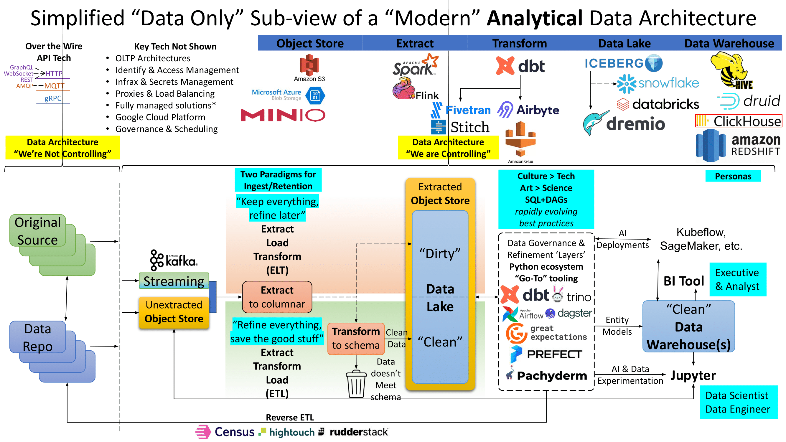

## AI is so hot right now

!!! quote "Data Engineer"
    Data engineers work in a variety of settings to build systems that collect, manage, and convert raw 
    data into usable information for data scientists and business analysts to interpret. Their ultimate 
    goal is to make data accessible so that organizations can use it to evaluate and optimize their 
    performance. - [Coursera](https://www.coursera.org/articles/what-does-a-data-engineer-do-and-how-do-i-become-one)

A popular military proverb goes _"amateurs talk tactics, professionals talk logistics"_.
The feverish interest in "AI" lends itself to a similar observation: _"amateurs talk
AI, professionals talk data engineering"_. Like tactics and pitched battles, AI is the
flashy end result of months and years of deliberate logistical preparation. This workshop
focuses on introducing several key concepts for Python programmers to be excellent
_data engineers_ that can deliver value and save costs.

## A very summarized overview of modern data engineering

1. **Extract (aka "Map")**: Open the source data into memory or working swap disc
2. **Transform (aka "Shuffle and Reduce")**: Apply expectations of data schema, "enrich"
with additional context or tooling (AI), and (potentially) ignore or summarize data to 
reduce volume (cost) and maximize value
3. **Load**: Store the result

!!! tip "ETL vs ELT"
    But wait, what is all this about ETL vs ELT?

    **Extract, Transform, Load** 
    ETL fundamentally assumed the organization knows _a priori_ all questions it could
    possibly want to ask of its data or has significant budget constraints it must meet.
    The ETL was a requirement in the 90s and early 2000s when computers were running
    databases and simply couldn't store GBs, TBs, or PBs of data... much more in a cost
    effective manner.

    **Extract, Load, Transform** 
    ELT has gained popularity for two reasons. First, magnetic disc storage cost
    became neglible and technologically easy to maintain in great quantities. A small
    business can easily maintain half a petabyte of storage in one 42U rack for the cost
    of a new economy car. Second, large business realized they were losing agility and
    spending a tremendous amount of time and manpower trying to enforce data schemas in
    each business unit. The ELT approach instead shifts to robust data engineering tools
    and teams that automate data quality checks and transformation pipelines to answer
    specific questions or use cases that clearly provide value. If a business unit changes
    their data, the fault is immediately detected. Data engineers are empowered to quickly
    understand what changed and apply an update to affected pipelines.

### Types of Data
1. **Unstructured**: Requires manual human review or specialized processing tools to extract
quantifiable data. Powerpoints, PDFs, images, sound recordings, etc.
2. **Semi-Structured**: Well defined but highly flexible data structures or file formats.
JSON, XML, HTML, Excel Spreadsheet, etc.
3. **Structured**: Well defined and inflexible data structures with fixed data types.
SQL Database, CSV, parquet, Pandas DataFrame, Numpy NDArray, etc.

In general, data engineers have two goals. First, convert unstructured and semi-
structured data into structured data according to business rules. Second, seek efficiencies
(in both cost and operational agility) by refining structured data into "high quality" 
subsets or summaries ready for analysts, business intelligence (BI) tools, and AI workflows.

### Types of "big data" storage technology
**Online Analytical Processing (OLAP)** 

- **Data Lake**: Files on a hard drive. Files could be unstructured, semi-structured, or structured.
Unlikely to provide full support for SQL queries over all data stored. Optimized for create operations.
- **Data Warehouse**: Structured data files partially or fully in memory (RAM). Provides a SQL interface.
Optimized for create and read operations.
- **Data Lakehouse**: A data lake that provides a SQL interface. Operationally slower but more
cost-effective than a data warehouse. Optimized for create and read operations.

**Online Transactional Processing (OLTP)** 
- **Database**: Transactional data storage optimized for create, read, ==update, and delete== operations.
Generally not intended for large amounts of data unless implemented using a "NoSQL" technology.

