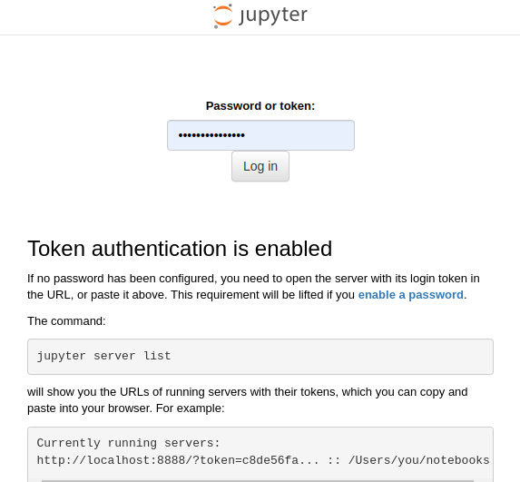

## What is Dask?

The [Dask Tutorial](https://tutorial.dask.org/00_overview.html) and [this article](https://www.nvidia.com/en-us/glossary/dask/)
by NVIDIA has decent infographics and explanations on what Dask is. The VERY summarized
explanation is it's a library that combines [Tornado](https://www.tornadoweb.org/en/stable/) and Pandas so
that an arbitrary number of Python interpreters and Pandas DataFrames can be used as if
they were a single interpreter and DataFrame.

The [Journey of a Task](https://distributed.dask.org/en/latest/journey.html) explanation
by the Dask authors provides a nice end-to-end primer on how the framework operates.

It is also worth noting that the [Ray](https://www.ray.io/) Python GPU acceleration framework is rapidly growing in
popularity. It can be used as a standalone framework or in conjunction with Dask, Celery, Prefect, Airflow, and other 
Python data engineering tools.

## What is Coiled and Prefect?
Dask fits into a growing segment of the data/tech industry where Free and Open Source
Software (FOSS) is provided with fully-managed and extended offerings made available by
the primary contributors to make an income.

Two of the more prominent companies aligned with Dask are [Coiled.io](https://www.coiled.io/)
and [Prefect](https://www.prefect.io/). Coiled is basically a fully-managed Dask cluster while Prefect is an
expanded offering more geared towards [ETL pipelines](https://examples.dask.org/applications/prefect-etl.html).


## Dask created hands-on crash course
[Dask :simple-dask:](http://dask.localhost:57073/status){ .md-button .md-button--primary}


[Jupyter Notebook :simple-jupyter:](http://notebook.localhost:57073/){ .md-button .md-button--primary}

Transition to the official crash-course running on your computer to get comfortable with
the framework.



Your login token will be listed in the terminal next to an `avengercon-dask-notebook` log entry. You'll need to 
copy-paste just the token portion of the url

``` terminal hl_lines="2"
avengercon-dask-notebook       | [... ServerApp] Jupyter Server 2.12.5 is running at:
avengercon-dask-notebook       | [... ServerApp] http://fd52fdf68911:8888/lab?token=b952e22de792f69923d281c04f66393518cd74a0c7fd1acf
                                            EVERYTHING AFTER THE = IS YOUR TOKEN    ^^^^^^^^^^^^^^^^^^^^^^^^^^^^^^^^^^^^^^^^^^^^^^^^

avengercon-dask-notebook       | [I 2024-02-17 19:42:45.576 ServerApp]     http://127.0.0.1:8888/lab?token=b952e22de792f69923d281c04f66393518cd74a0c7fd1acf
avengercon-dask-notebook       | [I 2024-02-17 19:42:45.576 ServerApp] Use Control-C to stop this server and shut down all kernels (twice to skip confirmation).
```

    

## Preparing for using Dask in your own projects

Since we've already seen some basics of using Dask in the Jupyter notebooks, let's
transition to a couple of tasks using Prefect.