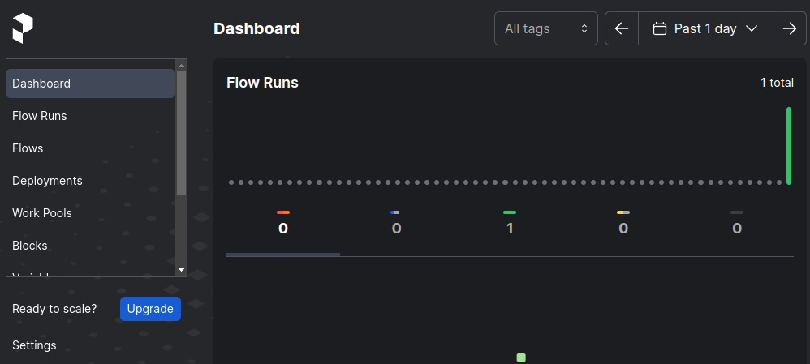

### Airflow
[Airflow](https://airflow.apache.org/) is the "OG" of Python data engineering automation.
It's offered as open source code or a fully managed service on various cloud providers
(e.g. GCP's DataProc). It still retains a large market share but can be difficult to use.
These difficulties led to the rise of newer tools like Prefect or Pachyderm.

### Prefect

[Prefect](https://www.prefect.io/) allows automation and monitoring of Python by adding 
decorators (`@`) above otherwise normal Python functions. The way your code is packaged
and automated is very similar the Celery... just much more polished.

### Pachyderm
[Pachyderm](https://www.pachyderm.com/) also enabled python data engineering automation
but takes a container-centric approach. Unlike Aiflow or Prefect which are mostly Python
native tools, Pachyderm packages each step of a workflow in a container to maximize
consistency and portability. This approach allows it to expand beyond Python to also support
java, scala, and possibly more as time goes on.

### Other fully managed or semi-proprietary solutions
Here's a quick rundown of other data engineering pipeline tools that have significant
market share. These aren't necessarily specific to python but can help augment Python-based
ETL or ELT workflows.

1. [Airbyte](https://airbyte.com/): Self-managed and fully managed options. Based on largely point-and-click "connectors" for source and
sinks of data.

2. [Dagster](https://dagster.io/): An connector-focused ETL orchestration tool intended to be a more engineer friendly
iteration on the Airflow use case.

3. [Fivetran](https://www.fivetran.com/): One of the first offerings in the data engineering
space and still widely used.

4. [Stitch](https://www.stitchdata.com/): Another of the earlier data engineering companies.

5. [AWS Glue](https://aws.amazon.com/glue/): Amazon Web Service's proprietary ETL pipeline tool.

6. [Azure Fabric](https://www.microsoft.com/en-us/microsoft-fabric): Microsoft's fully-managed offering.

7. [DBT](https://www.getdbt.com/): Meteorically taking over the ELT market for data pipelines. More on DBT and Object Relational Mapper 
(ORM) tooling on the next page.

8. [Apache DataFusion](https://datafusion.apache.org/): A project gaining in popularity intended to combine
DataFrame (internal type, Pandas, or Polars) and SQL based data sources and sinks into an integrated workflow. Integrates
with Python, Ray, and Spark.
